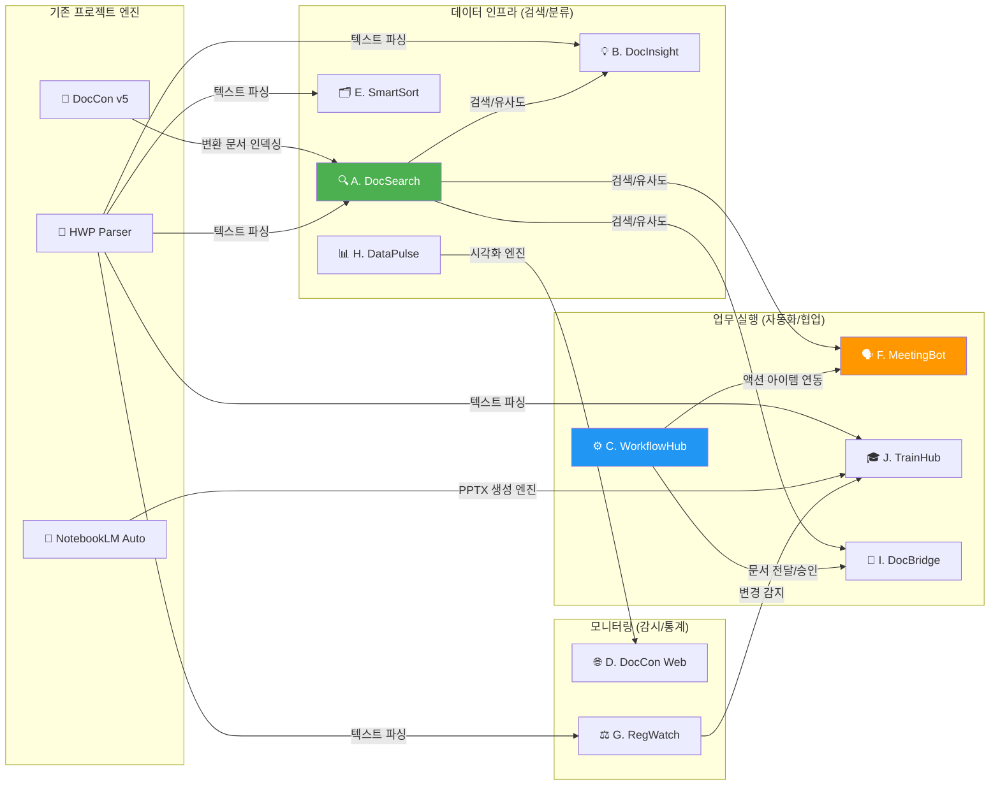
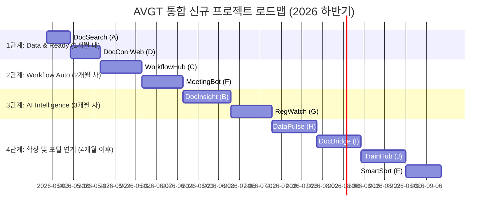

# 📋 AVGT 신규 업무 개선 프로젝트 통합 제안 보고서

> **작성일**: 2026-04-23  
> **작성자**: Antigravity AI  
> **대상**: 강원대학교병원 AVGT 업무 자동화 프로젝트  
> **문서 유형**: 프로젝트 상세 기획 보고서 (통합본: A~J 총 10건)

---

## 목차

1. [도입 및 기존 포트폴리오 분석](#1-도입-및-기존-포트폴리오-분석)
2. [전체 프로젝트 요약 및 시너지 트리](#2-전체-프로젝트-요약-및-시너지-트리)
3. [상세 기획: 데이터 활용 파트 (A, B, E)](#3-상세-기획-데이터-활용-파트-a-b-e)
   - [A. DocSearch (내부 문서 검색)](#프로젝트-a-docsearch--내부-문서-검색-엔진)
   - [B. DocInsight (AI 문서 분석)](#프로젝트-b-docinsight--ai-문서-분석-대시보드)
   - [E. SmartSort (AI 파일 분류)](#프로젝트-e-smartsort--ai-파일-자동-분류)
4. [상세 기획: 업무 자동화 파트 (C, F, J)](#4-상세-기획-업무-자동화-파트-c-f-j)
   - [C. WorkflowHub (문서 자동화)](#프로젝트-c-workflowhub--병원-업무-자동화-허브)
   - [F. MeetingBot (회의록 자동화)](#프로젝트-f-meetingbot--ai-회의록-자동화)
   - [J. TrainHub (교육 자료 자동화)](#프로젝트-j-trainhub--직원-교육-자료-자동-생성)
5. [상세 기획: 모니터링 & 협업 파트 (D, G, H, I)](#5-상세-기획-모니터링--협업-파트-d-g-h-i)
   - [D. DocCon Web (변환 모니터링)](#프로젝트-d-doccon-web--변환-모니터링-대시보드)
   - [G. RegWatch (규정 모니터링)](#프로젝트-g-regwatch--규정-변경-모니터링)
   - [H. DataPulse (운영 데이터 BI)](#프로젝트-h-datapulse--운영-데이터-bi-대시보드)
   - [I. DocBridge (문서 협업 포털)](#프로젝트-i-docbridge--부서-간-문서-협업-포털)
6. [통합 아키텍처 및 평가 매트릭스](#6-통합-아키텍처-및-평가-매트릭스)
7. [실행 로드맵](#7-실행-로드맵)

---

## 1. 도입 및 기존 포트폴리오 분석

현재 AVGT 워크스페이스에서 운영 중인 4개의 훌륭한 시스템(DocCon v5, NotebookLM Automation, KNUH Map, HWP Parser)과 병원의 핵심 업무 페인포인트를 분석하여, 이를 획기적으로 개선할 **10가지 신규 스마트 워크 프로젝트**를 기획했습니다.

모든 프로젝트는 현재 사용 중인 기술(Python/FastAPI/SQLite/Vanilla JS)을 기반으로 하여, 하나의 시스템에서 만들어진 결과물을 다른 시스템에서 재활용하는 '플라이휠' 구조를 지향합니다.

---

## 2. 전체 프로젝트 요약 및 시너지 트리

### 2.1 10대 프로젝트 요약

| 프로젝트명 | 핵심 기능 | 목표 절감 시간/효과 |
|:----------|:----------|:-------------------|
| **A. DocSearch** | 전문 검색: 파일 내용까지 빠른 검색 | 검색시간 30분 → 10초 |
| **B. DocInsight** | 분석/요약: 문서 내용 자동 요약/관계 매핑 | 업무파악 2주 → 2일 |
| **C. WorkflowHub** | 자동생성: 반복 행정/보고서 자동 생성 | 공문작성 건당 30분 절약 |
| **D. DocCon Web** | 모니터링: 웹에서 통합 관리/통계 확인 | 원격 모니터링 (100% 가시성) |
| **E. SmartSort** | 파일정리: 폴더/카테고리 자동 재분류 | 디스크 공간 관리 최적화 |
| **F. MeetingBot** | 회의자동화: 음성→텍스트, 액션아이템 도출 | 회의록 작성 60분 → 5분 |
| **G. RegWatch** | 규정감시: 변경된 법규/규정 자동 감지 | 규정 미준수 위험 제거 |
| **H. DataPulse** | BI시각화: 핵심 지표 실시간 대시보드 | 전사 데이터 한눈에 파악 |
| **I. DocBridge** | 협업포털: 문서 발송/수신 자동 추적 | 누락 및 이력 추적률 100% |
| **J. TrainHub** | 교육자료: 규정/매뉴얼을 교육콘텐츠로 | 교육자료 제작 10시간 → 30분 |

### 2.2 전체 시너지 맵 (1차 + 2차 연결 구조)

---

## 3. 상세 기획: 데이터 활용 파트 (A, B, E)

수천 건의 파일(공문, 매뉴얼 등)을 어떻게 저장하고 찾으며 분석할 것인가?

### A. DocSearch — 내부 문서 검색 엔진

- **목표:** 병원의 산재된 변환 문서들을 즉시 0.3초 내 검색 및 미리보기.
- **핵심 기능:**
  - SQLite FTS5 기반의 빠르고 가벼운 전문 인덱싱(형태소 지원).
  - DocCon의 `_converted` 폴더 Watchdog 감시를 통한 자동 업데이트.
  - 키워드 하이라이팅 및 1클릭 원본 파일 열기.
- **개발 기간:** 5~8일

### B. DocInsight — AI 문서 분석 대시보드

- **목표:** 문서 간 숨겨진 관계를 찾고 핵심을 3줄 요약하여 직원의 이해도 비약적 향상.
- **핵심 기능:**
  - LLM 자동 요약 및 NER(인물, 부서, 규칙) 엔티티 추출.
  - 문서 간 네트워크 관계도 시각화(D3.js).
  - ChromaDB 연동 자연어 질의응답 (RAG).
- **개발 기간:** 12~16일

### E. SmartSort — AI 파일 자동 분류

- **목표:** 무질서한 공유/개인 폴더를 통합 정리하고 명명 규칙 표준화.
- **핵심 기능:**
  - DocCon의 중복(Hash/Name/Size) 제거 기술에 내용 유사도 검토 기능 강화.
  - 텍스트 내용을 바탕으로 LLM이 문서 종류 태깅 & 자동 폴더 이동/변경안 제시.
  - 안전한 미리보기 통과 시 실행, 언제든 복구 가능한 롤백 히스토리 제공.
- **개발 기간:** 10~14일

---

## 4. 상세 기획: 업무 자동화 파트 (C, F, J)

반복되는 수작업 문서 생성과 귀찮은 정리 업무를 AI로 해방.

### C. WorkflowHub — 병원 업무 자동화 허브

- **목표:** 임명장, 공문, 정기 보고서 형태를 템플릿화하여 최소 입력으로 서류 완성.
- **핵심 기능:**
  - Jinja2/HWP Parser 기반: 변수(수신자, 내역)만 채워넣는 템플릿 엔진.
  - Excel 피벗 집계 파이프라인 (월별, 연별 통계 수치를 차트로 자동 반영).
  - 진행상황 승인 관리 및 토스트(시스템 트레이) 알림.
- **개발 기간:** 11~15일

### F. MeetingBot — AI 회의록 자동화

- **목표:** 녹음된 음성을 즉시 텍스트로, 텍스트를 즉시 액션으로 번역하는 궁극의 회의 도우미.
- **핵심 기능:**
  - OpenAI Whisper-large-v3, pyannote를 활용해 화자 식별 및 전사.
  - LLM으로 요약, 안건/결정사항 분리, 이메일 추적용 할 일(액션 아이템) 추출.
  - 칸반 보드로 이행 관리.
- **개발 기간:** 11~15일

### J. TrainHub — 직원 교육 자료 자동 생성

- **목표:** 복잡한 내부 규정과 메뉴얼을 즉시 PPT 교육 자료, 퀴즈 모델로 재생성.
- **핵심 기능:**
  - NotebookLM Automation의 `create_pptx` 엔진 재활용 + AI 텍스트 추출/병합.
  - LLM 모델이 자동으로 객관식/O,X 퀴즈를 출제하여 평가 체계 구축.
  - 교육 이수 현황 기록 및 미이수자 알림 시스템.
- **개발 기간:** 13~17일

---

## 5. 상세 기획: 모니터링 & 협업 파트 (D, G, H, I)

놓치기 쉬운 주요 변경점의 감시와 구성원 간 원활한 문서 소통 창구.

### D. DocCon Web — 변환 모니터링 대시보드

- **목표:** 데스크톱 프로그램인 DocCon을 원격/웹 환경에서 실시간 렌더링/제어.
- **핵심 기능:**
  - FastAPI+WebSocket으로 변환 상황, ETA를 실시간 브라우저 스트리밍.
  - 성공/실패/중복 이력을 SQLite에 적재하여 통계 분석 기능 제공.
- **개발 기간:** 8~12일

### G. RegWatch — 규정 변경 모니터링

- **목표:** 안팎(정부부처/내규)의 변경 사항을 추적 및 리포팅하여 법적/규정 리스크 억제.
- **핵심 기능:**
  - 웹 크롤링을 이용한 공시/고시 수집(복지부, 심평원 등).
  - 내부 버전별 문서 간의 Diff(비교점) 추적 및 관련된 담당 부서 매핑/알림 기능.
- **개발 기간:** 12~16일

### H. DataPulse — 운영 데이터 BI 대시보드

- **목표:** 진료/예산/수술 건수(Excel) 등을 모아 라이브 대시보드 및 TV 송출 최적화.
- **핵심 기능:**
  - Excel 파일을 공유 네트워크에서 자동 Scan/가공 (ETL 파이프라인).
  - 이상치(급등락 Z-score) 발생 시 모바일/이메일 자동 알림.
  - 차트(ApexChart) 및 통계 대시보드 실시간 반응형 지원.
- **개발 기간:** 12~16일

### I. DocBridge — 부서 간 문서 협업 포털

- **목표:** 이메일보다 직관적인 수·발신, 자료요청, 100% 읽음 확인 달성.
- **핵심 기능:**
  - 양방향 '수신-열람' 워크플로우를 통한 강력한 감사 추적(Audit Trail).
  - 요청문서/참고문서/긴급문서 등급화 설계.
- **개발 기간:** 12~16일

---

## 6. 통합 아키텍처 및 평가 매트릭스

### 6.1 통합 기술 스택

모든 프로젝트는 서로 완벽히 호환되도록 구성되었습니다.

| 레이어 | 기술 및 모듈 |
|-------|------------|
| **Core AI / NLP** | OpenAI Whisper, pyannote(음성/화자분리), Gemini API(생성/요약/매핑) |
| **Backend / API** | Python, FastAPI, Uvicorn (비동기 실시간), asyncio |
| **Data / Storage** | SQLite FTS5 (검색), ChromaDB (벡터DB), SQLite (메타/스토리) |
| **문서 변환/추출** | HWP Parser(기존 자산), python-pptx, openpyxl, pandas |
| **Frontend/Viz** | HTML/CSS/JS (Vanilla & Streamlit), D3.js(관계도), Chart.js |
| **Automation** | Watchdog (파일이벤트), APScheduler (배치/시간스케줄), Windows Toast |

### 6.2 10대 프로젝트 최종 평가 매트릭스

| 추천 | 프로젝트 (코드) | 실용성 | 난이도 | 자산재사용 | 업무임팩트 | 기간 |
|:---:|:--------------|:---:|:---:|:----:|:---:|:---:|
| 1 | **DocSearch (A)** | ⭐⭐⭐⭐⭐ | ⭐⭐ | ⭐⭐⭐⭐⭐ | ⭐⭐⭐⭐ | 5~8일 |
| 2 | **WorkflowHub (C)**| ⭐⭐⭐⭐⭐ | ⭐⭐⭐ | ⭐⭐⭐ | ⭐⭐⭐⭐⭐ | 11~15일 |
| 3 | **MeetingBot (F)** | ⭐⭐⭐⭐⭐ | ⭐⭐⭐⭐ | ⭐⭐⭐⭐ | ⭐⭐⭐⭐⭐ | 11~15일 |
| 4 | **RegWatch (G)** | ⭐⭐⭐⭐ | ⭐⭐⭐ | ⭐⭐⭐⭐ | ⭐⭐⭐⭐⭐ | 12~16일 |
| 5 | **DocInsight (B)** | ⭐⭐⭐ | ⭐⭐⭐⭐ | ⭐⭐⭐⭐ | ⭐⭐⭐⭐⭐ | 12~16일 |
| 6 | DataPulse (H) | ⭐⭐⭐⭐⭐ | ⭐⭐⭐ | ⭐⭐⭐⭐⭐ | ⭐⭐⭐⭐⭐ | 12~16일 |
| 7 | DocCon Web (D) | ⭐⭐⭐⭐ | ⭐⭐⭐ | ⭐⭐⭐⭐⭐ | ⭐⭐⭐ | 8~12일 |
| 8 | SmartSort (E) | ⭐⭐⭐ | ⭐⭐⭐⭐ | ⭐⭐⭐⭐⭐ | ⭐⭐⭐ | 10~14일 |
| 9 | DocBridge (I) | ⭐⭐⭐ | ⭐⭐⭐ | ⭐⭐⭐ | ⭐⭐⭐⭐ | 12~16일 |
| 10| TrainHub (J) | ⭐⭐⭐ | ⭐⭐⭐⭐ | ⭐⭐⭐⭐⭐ | ⭐⭐⭐⭐ | 13~17일 |

---

## 7. 실행 로드맵

**"가장 빠르고, 가장 체감이 큰 프로젝트부터 단계별 확대"**

> [!TIP]
> **성공 전략: 퀵-윈(Quick-Win) 접근**
> 기존 생산물을 그대로 즉시 검색 가능한 인덱스 구조로 탈바꿈하는 **DocSearch**가 첫 번째 단추로 가장 유효하며, 반복 업무 빈도가 월등한 **WorkflowHub**와 오디오-투-인사이트 패러다임을 확립할 **MeetingBot** 순서로 확장을 권장합니다.
