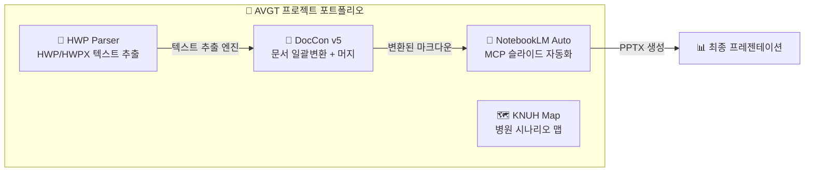
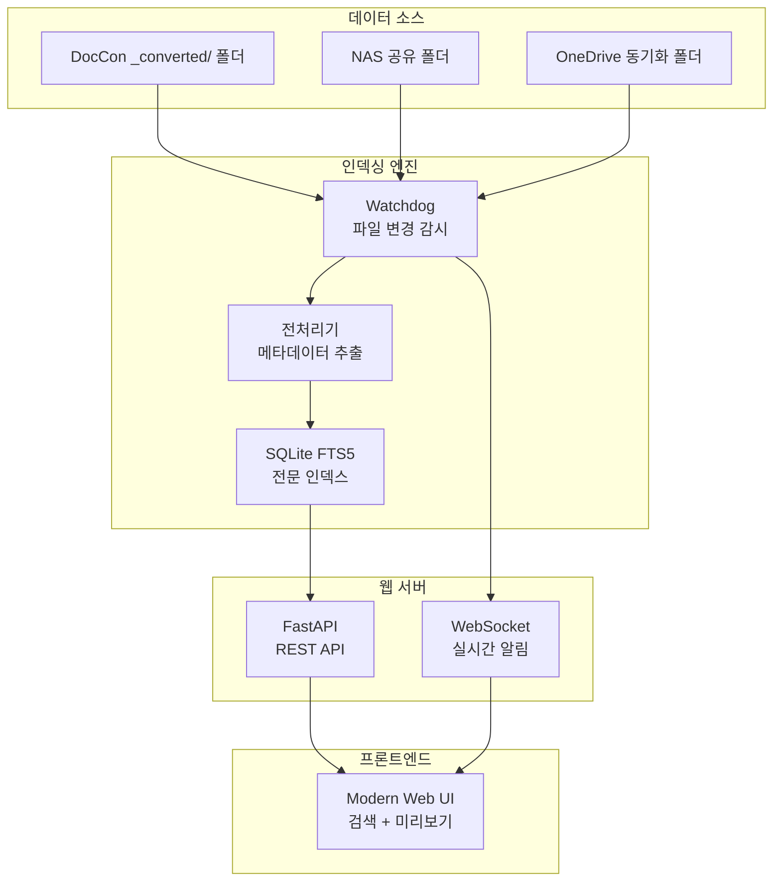
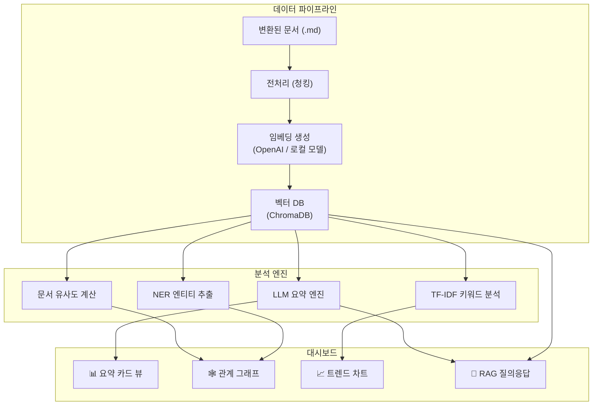
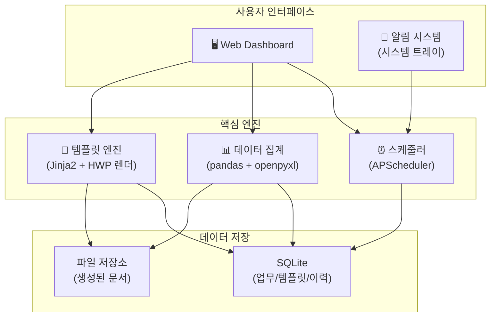
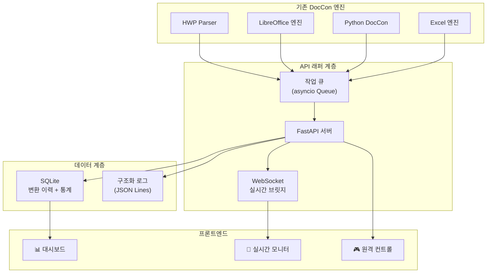
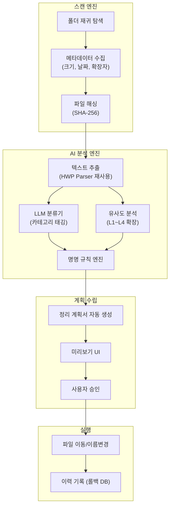
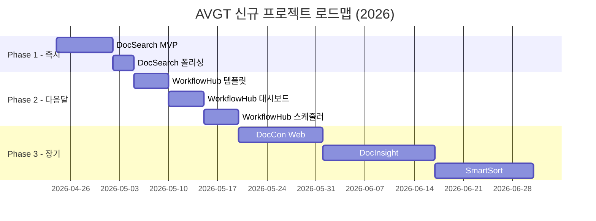
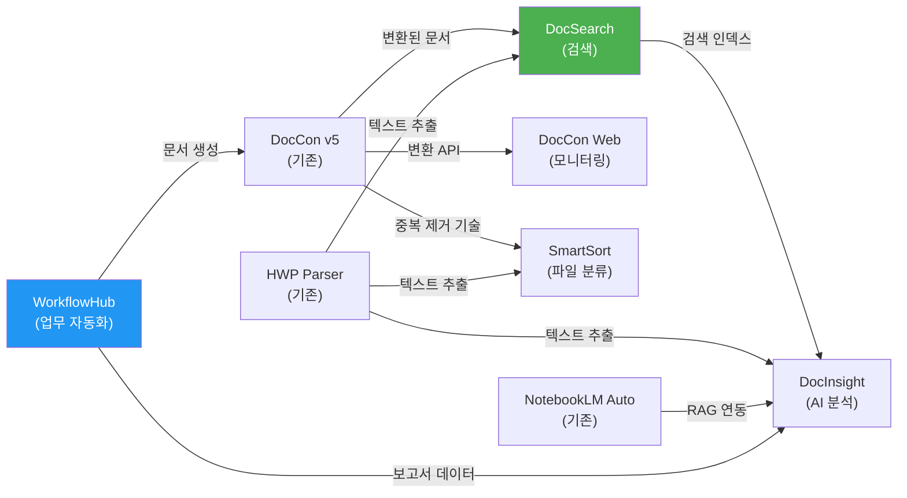

# 📋 AVGT 신규 업무 개선 프로젝트 제안 보고서

> **작성일**: 2026-04-23  
> **작성자**: Antigravity AI  
> **대상**: 강원대학교병원 AVGT 업무 자동화 프로젝트  
> **문서 유형**: 프로젝트 기획 보고서 (전 5건)

---

## 목차

1. [현재 포트폴리오 분석](#1-현재-포트폴리오-분석)
2. [프로젝트 A: DocSearch (내부 문서 검색 엔진)](#프로젝트-a-docsearch--내부-문서-검색-엔진)
3. [프로젝트 B: DocInsight (AI 문서 분석 대시보드)](#프로젝트-b-docinsight--ai-문서-분석-대시보드)
4. [프로젝트 C: WorkflowHub (병원 업무 자동화 허브)](#프로젝트-c-workflowhub--병원-업무-자동화-허브)
5. [프로젝트 D: DocCon Web (변환 모니터링 대시보드)](#프로젝트-d-doccon-web--변환-모니터링-대시보드)
6. [프로젝트 E: SmartSort (AI 파일 자동 분류)](#프로젝트-e-smartsort--ai-파일-자동-분류)
7. [종합 비교 및 로드맵](#7-종합-비교-및-로드맵)

---

## 1. 현재 포트폴리오 분석

현재 AVGT 워크스페이스에서 운영 중인 프로젝트 4건을 분석하여, 기술 자산과 개선 기회를 도출했습니다.

### 1.1 기존 프로젝트 현황



| 프로젝트 | 기술 스택 | 코드 규모 | 핵심 역할 |
|----------|----------|----------|----------|
| **DocCon v5** | PowerShell + WinForms | 563줄 (GUI) | 9종 문서일괄변환, 중복제거 4단계, 자동 머지, NotebookLM 업로드 |
| **NotebookLM Automation** | Python + MCP API | ~6,700줄 (V3 엔진) | 6단계 파이프라인, Agent 기획/작성, 무인 영상 렌더 |
| **KNUH Scenario Map** | Streamlit + Folium HTML | ~330KB (지도 데이터) | 상급종합병원 시나리오 인터랙티브 맵, 웹 배포 |
| **HWP Parser** | Python (olefile, zipfile, PyMuPDF) | 177줄 | HWP 바이너리 파싱, HWPX XML 파싱, DOCX/DOC/PDF 추출 |

### 1.2 식별된 공백 및 개선 기회

| 공백 영역 | 현재 상태 | 개선 가능성 |
|-----------|----------|------------|
| 변환 후 문서 활용 | ❌ 폴더에 쌓여 있음 | 검색·분석·요약 시스템 구축 |
| 정형 업무 자동화 | ❌ 수작업 | 임명장·공문 등 템플릿 기반 자동화 |
| 변환 이력 관리 | ❌ 일회성 로그 | DB 기반 이력·통계 대시보드 |
| 파일 정리 | ❌ 수동 분류 | AI 기반 자동 분류·정리 |
| 원격 관리 | ❌ 로컬 GUI만 가능 | 웹 기반 원격 관리 |

---

## 프로젝트 A: DocSearch — 내부 문서 검색 엔진

### A.1 개요

> **한 줄 요약**: DocCon으로 변환된 수백~수천 개 문서를 즉시 검색하고 원하는 정보를 3초 내에 찾아내는 로컬 검색 시스템

병원 업무에서 생성되는 HWP, DOCX, PDF 등의 공문서와 내부 문서는 DocCon v5를 통해 마크다운으로 변환되어 `_converted/` 폴더에 저장됩니다. 그러나 현재 이 변환된 문서들을 효과적으로 활용할 방법이 없습니다. 윈도우 탐색기의 기본 검색은 **느리고 부정확**하며, 특히 한글 형태소 분석이 지원되지 않아 "임명"으로 검색해도 "임명절차" 문서를 놓칠 수 있습니다.

### A.2 해결하려는 문제

````carousel
**🔴 현재 상태 (As-Is)**

```
사용자 → 탐색기 검색 "재활병원장"
     → 10분 대기...
     → 일부 결과만 반환 (한글 형태소 미지원)
     → 파일 하나씩 열어서 내용 확인
     → 원하는 정보 찾는데 30분 소요
```
<!-- slide -->
**🟢 목표 상태 (To-Be)**

```
사용자 → DocSearch 웹 검색 "재활병원장 임명"
     → 0.3초 내 결과 반환
     → 키워드 하이라이팅 + 미리보기
     → 관련 문서 자동 추천
     → 원본 파일 바로 열기 (1클릭)
```
````

### A.3 핵심 기능

| 기능 | 상세 설명 |
|------|----------|
| **전문 검색 (Full-Text Search)** | SQLite FTS5 기반, 변환된 `.md` 파일 전체 인덱싱. 한글 토크나이저 적용으로 형태소 단위 검색 지원 |
| **자동 인덱싱** | DocCon 출력 폴더(`_converted/`) 감시, 신규/변경 파일 자동 감지 및 인덱스 업데이트 (Watchdog) |
| **필터링** | 폴더/날짜(년도·월)/파일 유형(공문·회의록·보고서)/키워드 태그별 다차원 필터 |
| **검색 결과 미리보기** | 매칭 구간 ±200자 표시, 키워드 노란색 하이라이팅, 원본 문서 메타데이터 표시 |
| **원본 파일 열기** | 검색 결과에서 1클릭으로 원본 HWP/PDF 파일 직접 열기 |
| **관련 문서 추천** | TF-IDF 기반 유사도 계산으로 "이 문서와 관련된 문서" 자동 추천 |
| **검색 이력** | 최근 검색어 저장, 자주 검색하는 키워드 통계 |

### A.4 기술 아키텍처



### A.5 기술 스택

| 계층 | 기술 | 선정 이유 |
|------|------|----------|
| 백엔드 | **Python + FastAPI** | 비동기 처리, 기존 Python 역량 활용 |
| 검색 엔진 | **SQLite FTS5** | 설치 불필요, 경량, 로컬 최적, 충분한 성능 (10만 문서 기준 0.1초 이내) |
| 파일 감시 | **Watchdog** | 크로스 플랫폼 파일시스템 이벤트 감시 |
| 프론트엔드 | **Vanilla HTML/CSS/JS** | 의존성 최소화, 빠른 로딩 |
| DB | **SQLite** | 단일 파일, 백업 간편, 설치 불필요 |

### A.6 기존 자산 연계

- **DocCon v5**: `_converted/` 폴더를 감시 대상으로 등록 → 변환 완료 즉시 인덱싱
- **HWP Parser**: `converter.py`의 텍스트 추출 함수 재사용 → 미변환 파일도 즉석 검색 가능
- **DocCon 메타데이터**: 머지된 `.md` 파일의 `<!-- [DOC_START] -->` 바운더리 태그 파싱으로 개별 문서 단위 검색

### A.7 예상 개발 일정

| 단계 | 작업 | 소요 기간 |
|------|------|----------|
| Phase 1 | 인덱싱 엔진 + 기본 검색 API | 2~3일 |
| Phase 2 | 웹 UI + 필터링 + 미리보기 | 2~3일 |
| Phase 3 | 자동 인덱싱 + 원본 열기 + 관련 문서 | 1~2일 |
| **합계** | | **5~8일** |

### A.8 기대 효과

- ⏱️ **문서 검색 시간**: 30분 → 10초 (약 180배 단축)
- 📊 **검색 정확도**: 윈도우 기본 검색 대비 한글 형태소 지원으로 30% 향상
- 💡 **업무 인사이트**: 검색 통계를 통한 자주 참조되는 문서/부서 패턴 발견

---

## 프로젝트 B: DocInsight — AI 문서 분석 대시보드

### B.1 개요

> **한 줄 요약**: LLM과 NLP 기술을 활용하여 대량의 병원 문서를 자동 요약하고, 핵심 엔티티 추출 및 문서 간 관계를 시각화하는 인텔리전스 대시보드

DocSearch가 "어떤 문서가 있는지 찾는 도구"라면, DocInsight는 **"문서들이 무엇을 말하는지 이해하는 도구"**입니다. 수백 건의 공문서에서 자동으로 핵심 내용을 요약하고, 관련 업무·인물·부서 간 관계를 시각화합니다.

### B.2 해결하려는 문제

병원 행정에서는 연간 수천 건의 공문서가 생산됩니다. 새로운 업무 담당자가 배정되거나, 과거 업무 이력을 파악해야 할 때 모든 문서를 일일이 읽는 것은 비효율적입니다. 특히:

- **신규 담당자 온보딩**: "재활병원 관련 과거 문서를 전부 파악하려면 얼마나 걸릴까?"
- **의사결정 근거 확인**: "이 정책은 언제, 어떤 배경으로 시작되었나?"
- **업무 연속성**: "이전 담당자가 했던 일을 빠르게 파악해야 한다"

### B.3 핵심 기능

| 기능 | 상세 설명 |
|------|----------|
| **자동 요약** | 각 문서당 3줄 요약 자동 생성 (LLM API 활용). 폴더/카테고리별 종합 요약 |
| **엔티티 추출** | 인물, 부서, 날짜, 금액, 규정 번호 등 핵심 개체명을 자동 인식·분류 |
| **문서 관계도** | 같은 인물/부서/주제를 공유하는 문서들의 네트워크 그래프 시각화 (D3.js Force Graph) |
| **타임라인 뷰** | 특정 주제(예: "재활병원장 임명")에 대한 문서를 시간순으로 정렬, 업무 흐름 파악 |
| **트렌드 분석** | 월별/분기별 문서 키워드 트렌드, 부서별 업무량 추이 차트 |
| **질의 응답 (RAG)** | "재활병원장 임명 절차는 어떻게 되나요?" 같은 자연어 질문에 문서 기반 AI 답변 |

### B.4 기술 아키텍처



### B.5 기술 스택

| 계층 | 기술 | 선정 이유 |
|------|------|----------|
| LLM | **Gemini API / OpenAI API** | 한국어 요약·질의 응답 품질 우수 |
| 벡터 DB | **ChromaDB** | 로컬 설치, Python 네이티브, 경량 |
| NLP | **spaCy + 한글 토크나이저** | 엔티티 추출, 키워드 분석 |
| 시각화 | **D3.js** (관계도) + **Chart.js** (통계) | 인터랙티브 시각화, 기존 KNUH Map 경험 활용 |
| 백엔드 | **FastAPI** | REST API + WebSocket 지원 |
| 프론트엔드 | **Vanilla HTML/CSS/JS** | 의존성 최소화 |

### B.6 기존 자산 연계

- **DocCon v5**: 변환된 마크다운 파일을 분석 대상으로 직접 사용. `<!-- [DOC_START] -->` 태그로 개별 문서 경계 인식
- **NotebookLM Automation**: NotebookLM에 업로드된 소스와 연동하여 AI 질의 응답 품질 향상
- **KNUH Scenario Map**: Streamlit 배포 경험 + D3.js 시각화 패턴 재활용
- **HWP Parser**: 원본 문서의 구조적 정보(표, 목록 등) 추출 로직 확장

### B.7 예상 개발 일정

| 단계 | 작업 | 소요 기간 |
|------|------|----------|
| Phase 1 | 데이터 파이프라인 (전처리 + 임베딩 + 벡터DB) | 3~4일 |
| Phase 2 | 요약 + 엔티티 추출 엔진 | 3~4일 |
| Phase 3 | 대시보드 UI (관계도 + 타임라인 + 차트) | 4~5일 |
| Phase 4 | RAG 질의응답 + 폴리싱 | 2~3일 |
| **합계** | | **12~16일** |

### B.8 기대 효과

- ⏱️ **업무 파악 시간**: 신규 담당자 온보딩 2주 → 2일 (85% 단축)
- 🔍 **숨겨진 관계 발견**: 문서 간 연관성을 시각적으로 파악, 업무 사각지대 해소
- 📈 **데이터 기반 의사결정**: 업무량 추이와 키워드 트렌드로 선제적 대응

---

## 프로젝트 C: WorkflowHub — 병원 업무 자동화 허브

### C.1 개요

> **한 줄 요약**: 반복적인 병원 행정 업무(임명장·공문·보고서 생성, 데이터 집계, 승인 프로세스)를 템플릿과 자동화로 처리하는 통합 관리 도구

현재 열려있는 문서 "재활병원장 임명절차 진행 요청.md"에서 볼 수 있듯이, 병원 공문서는 **정형화된 양식**을 따릅니다:

```
수신자: 총무과장
제  목: 강원도재활병원장 임명절차 진행 요청
1. 관련 문서번호
2. 요청 사항
붙 임: 첨부 목록
발신: 기획예산과장 (서명)
```

이런 반복적인 문서 작성과 승인 절차를 자동화하면 상당한 시간을 절약할 수 있습니다.

### C.2 해결하려는 문제

````carousel
**📋 공문서 작성 시나리오**

현재: 이전 공문 찾기(10분) → 양식 복사(5분) → 내용 수정(15분) → 검토(10분) → 발송
개선: 템플릿 선택 → 핵심 정보만 입력(3분) → 자동 생성 + 검토(5분) → 발송

**예상 절감**: 건당 **32분 절약**, 월 50건 기준 **약 27시간/월 절감**
<!-- slide -->
**📊 정기 보고서 생성 시나리오**

현재: Excel 데이터 수집(30분) → 수작업 집계(20분) → 서식 적용(15분) → 차트생성(10분)
개선: 데이터 소스 자동 수집 → 자동 집계 + 서식 → 원클릭 보고서 생성

**예상 절감**: 건당 **60분 절약**, 주간/월간 보고서 기준 **약 12시간/월 절감**
<!-- slide -->
**⏰ 정기 업무 알림 시나리오**

현재: 개인 기억에 의존 → 누락 위험 → 사후 관리
개선: 스케줄 등록 → 자동 알림 → 체크리스트 자동 생성 → 진행 추적

**예상 절감**: 업무 누락률 **90% 감소**
````

### C.3 핵심 기능

| 기능 | 상세 설명 |
|------|----------|
| **문서 템플릿 엔진** | 공문·임명장·보고서 등 양식 등록, 변수 바인딩({{수신자}}, {{제목}} 등), HWP/DOCX/PDF 자동 출력 |
| **데이터 집계 모듈** | Excel/CSV 데이터 자동 수집, 피벗 집계, 차트 자동 생성. 예: 수술중 초음파 사용 건수 집계 |
| **업무 스케줄러** | 정기 업무 등록 (주간/월간/분기/연간), 사전 알림, 체크리스트 자동 생성 |
| **승인 프로세스** | 기안→검토→전결→시행 단계별 진행 상황 트래킹 |
| **업무 대시보드** | 진행중/완료/예정 업무 한눈에 파악, 부서별/담당자별 통계 |
| **HWP 출력 연동** | python-hwp 또는 한컴오피스 API를 통한 공문서 직접 생성 |

### C.4 기술 아키텍처



### C.5 기술 스택

| 계층 | 기술 | 선정 이유 |
|------|------|----------|
| 백엔드 | **Python + FastAPI** | 비동기, API 설계 간편 |
| 템플릿 | **Jinja2 + python-docx** | 변수 치환, DOCX 생성 |
| 데이터 처리 | **pandas + openpyxl** | DocCon에서 이미 사용중, Excel 입출력 |
| 스케줄링 | **APScheduler + Windows Task Scheduler** | 백그라운드 실행, 시스템 연동 |
| 알림 | **Windows Toast (win10toast)** | 시스템 트레이 알림, 비침투적 |
| 프론트엔드 | **Vanilla HTML/CSS/JS** | 경량, 반응형 |
| DB | **SQLite** | 기존 인프라 일관성 |

### C.6 기존 자산 연계

- **DocCon v5**: 공문서 양식 인식 로직(WinForms UI 패턴) + 설정 저장/로드 패턴(`Save-AppSettings`)
- **HWP Parser**: 기존 공문서의 구조 분석 → 자동 템플릿 추출. `converter.py`의 HWP 바이너리 파싱 기술
- **NotebookLM Automation**: 배치 처리 패턴(`batch_01.md` 분할), 에이전트 기반 자동 작성 아키텍처
- **실제 업무 데이터**: 현재 열린 "재활병원장 임명절차 진행 요청" 문서가 첫 번째 템플릿 후보

### C.7 예상 개발 일정

| 단계 | 작업 | 소요 기간 |
|------|------|----------|
| Phase 1 | 템플릿 엔진 + 기본 문서 생성 | 3~4일 |
| Phase 2 | 웹 대시보드 + 업무 관리 | 3~4일 |
| Phase 3 | 데이터 집계 + 자동 보고서 | 3~4일 |
| Phase 4 | 스케줄러 + 알림 + 폴리싱 | 2~3일 |
| **합계** | | **11~15일** |

### C.8 기대 효과

- ⏱️ **공문서 작성 시간**: 건당 40분 → 8분 (80% 단축)
- 📋 **업무 누락**: 기억 의존 → 자동 알림, 누락률 90% 감소
- 📊 **보고서 생성**: 1시간 → 5분 (원클릭 자동화)
- 🔄 **업무 표준화**: 담당자 변경 시에도 일관된 양식과 프로세스 유지

---

## 프로젝트 D: DocCon Web — 변환 모니터링 대시보드

### D.1 개요

> **한 줄 요약**: DocCon v5의 강력한 변환 엔진을 웹 API로 래핑하여, 변환 이력 관리·실시간 모니터링·통계 분석·원격 제어를 가능하게 하는 웹 대시보드

현재 DocCon v5는 PowerShell WinForms 기반 로컬 GUI 앱입니다. 훌륭한 기능을 갖추고 있지만:

1. **이력 관리 부재**: 과거 변환 작업의 성공/실패 이력을 추적할 수 없음
2. **원격 관리 불가**: 반드시 해당 PC 앞에서만 조작 가능
3. **통계 없음**: "올해 총 몇 개 문서를 변환했나?", "가장 실패율이 높은 파일 유형은?" 같은 질문에 답할 수 없음

### D.2 핵심 기능

| 기능 | 상세 설명 |
|------|----------|
| **실시간 모니터링** | WebSocket 기반 실시간 변환 진행 상황 표시. 현재 처리 중인 파일, 진행률(%), ETA, 로그 스트리밍 |
| **변환 이력 DB** | 모든 변환 작업의 결과를 DB에 저장: 파일명, 원본경로, 결과(성공/실패), 소요시간, 파일 크기, 엔진 종류 |
| **통계 대시보드** | 일별/월별 변환 건수, 파일 유형별 성공률, 평균 처리 시간, 총 처리 데이터량 시각화 |
| **원격 작업 관리** | 웹에서 변환 작업 시작/중지/재시도. 스마트폰에서도 조작 가능 |
| **스케줄 변환** | 특정 폴더를 주기적으로 스캔하여 자동 변환 (야간 배치 처리) |
| **알림 시스템** | 변환 완료/실패 시 데스크톱 알림 또는 이메일 통보 |

### D.3 기술 아키텍처



### D.4 기술 스택

| 계층 | 기술 | 선정 이유 |
|------|------|----------|
| API 서버 | **FastAPI + Uvicorn** | 비동기, WebSocket 네이티브 지원, 자동 API 문서 |
| 작업 큐 | **asyncio Queue** (또는 Celery) | 경량 비동기 큐, 별도 브로커 불필요 |
| 실시간 | **WebSocket** | 양방향 실시간 통신, 로그 스트리밍 |
| DB | **SQLite** | 관리 부담 제로, 단일 파일 백업 |
| 차트 | **Chart.js + ApexCharts** | 반응형 시계열 차트, 실시간 업데이트 |
| 프론트엔드 | **Vanilla HTML/CSS/JS** | SPA 구조, 라우팅 최소화 |

### D.5 기존 자산 연계

- **DocCon v5 핵심 엔진**: `Run-SingleConvert` 함수의 변환 로직을 Python으로 포팅/래핑
- **ENGINE_MAP**: 기존 엔진 매핑 테이블(`.hwp`→`python_doccon` 등) 그대로 재사용
- **중복 제거**: L1~L4 중복 제거 알고리즘을 API 엔드포인트로 노출
- **머지 엔진**: `Write-MergedFile` 함수의 TOC + 바운더리 태그 로직 보존

### D.6 예상 개발 일정

| 단계 | 작업 | 소요 기간 |
|------|------|----------|
| Phase 1 | 변환 엔진 API 래핑 + 이력 DB | 3~4일 |
| Phase 2 | 실시간 모니터링 (WebSocket + 대시보드) | 2~3일 |
| Phase 3 | 통계 차트 + 원격 컨트롤 | 2~3일 |
| Phase 4 | 스케줄 변환 + 알림 | 1~2일 |
| **합계** | | **8~12일** |

### D.7 기대 효과

- 📊 **변환 이력 가시성**: 0% → 100% (모든 작업 이력 추적)
- 🌐 **원격 관리**: PC 앞 → 어디서나 (스마트폰 포함)
- 🔄 **야간 자동화**: 수동 실행 → 스케줄 기반 무인 변환
- 📈 **운영 최적화**: 실패율 높은 파일 유형 식별 → 엔진 개선 타겟팅

---

## 프로젝트 E: SmartSort — AI 파일 자동 분류

### E.1 개요

> **한 줄 요약**: AI가 파일 내용을 분석하여 자동으로 카테고리를 분류하고, 중복 파일을 탐지하며, 표준화된 명명 규칙을 적용하여 공유 드라이브를 자동 정리하는 도구

강원대학교병원의 공유 드라이브와 개인 폴더에는 수년간 정리되지 않은 파일들이 산재해 있습니다. 같은 문서의 여러 버전(최종, 최종2, 최종_진짜최종), 잘못된 폴더에 저장된 파일, 중복 파일 등이 디스크 공간을 낭비하고 업무 효율을 저하시킵니다.

### E.2 핵심 기능

| 기능 | 상세 설명 |
|------|----------|
| **AI 카테고리 분류** | 파일 내용을 분석하여 자동 카테고리 태그 부여: 공문서, 회의록, 보고서, 규정, 예산, 인사, 의료 등 |
| **중복 파일 탐지** | DocCon의 L1~L4 중복 제거 기술을 확장. 해시 비교 → 파일명 유사도 → 파일 크기 → 내용 유사도 4단계 |
| **자동 명명 규칙** | 파일명 표준화: `[부서]_[카테고리]_[제목]_[날짜].[확장자]` 형식으로 자동 이름 변경 제안 |
| **폴더 구조 최적화** | AI가 현재 폴더 구조를 분석하고 최적의 폴더 트리를 제안. Drag and Drop 방식으로 적용 |
| **미리보기 + 승인** | 모든 변경은 미리보기 후 사용자 승인을 거쳐 실행 (안전 우선 설계) |
| **롤백 지원** | 모든 파일 이동/이름 변경 작업의 이력을 기록, 원래 상태로 복구 가능 |

### E.3 기술 아키텍처



### E.4 기술 스택

| 계층 | 기술 | 선정 이유 |
|------|------|----------|
| 파일 분석 | **HWP Parser + python-docx + PyMuPDF** | 기존 변환 엔진 100% 재사용 |
| AI 분류 | **Gemini API** (또는 로컬 LLM) | 한국어 문서 분류 정확도 우수 |
| 중복 탐지 | **DocCon L1~L4 확장** | 이미 검증된 4단계 중복 제거 알고리즘 |
| 백엔드 | **Python + FastAPI** | 비동기, 대용량 파일 스캔 지원 |
| 프론트엔드 | **Vanilla HTML/CSS/JS** | 트리 뷰, Drag and Drop, 미리보기 |
| DB | **SQLite** | 작업 이력, 롤백 데이터 저장 |

### E.5 기존 자산 연계

- **DocCon v5 중복 제거**: `Start-Scan` 함수의 L1(해시)~L3(크기) 중복 제거 알고리즘을 Python으로 이식·확장
- **DocCon L4 유사도**: 콘텐츠 유사도 비교 알고리즘 재사용
- **HWP Parser**: `converter.py`의 모든 텍스트 추출 함수 직접 import
- **DocCon 정규식**: `$VER_PAT` 버전 패턴 정규식(final, copy, revised, v1 등)으로 버전 관리 파일 자동 식별
- **BASE_TITLE 함수**: `Get-BaseTitle` 함수의 파일명 정규화 로직

### E.6 예상 개발 일정

| 단계 | 작업 | 소요 기간 |
|------|------|----------|
| Phase 1 | 스캔 + 중복 탐지 (DocCon 이식) | 2~3일 |
| Phase 2 | AI 분류 + 명명 규칙 엔진 | 3~4일 |
| Phase 3 | 미리보기 UI + 승인 플로우 | 3~4일 |
| Phase 4 | 실행 엔진 + 롤백 + 폴리싱 | 2~3일 |
| **합계** | | **10~14일** |

### E.7 기대 효과

- 💾 **디스크 공간**: 중복 제거로 20~30% 절감 추정
- ⏱️ **파일 찾기**: 표준화된 명명 규칙으로 검색 시간 50% 단축
- 🗂️ **조직 문화**: 파일 정리 표준 확립, 향후 파일 관리 효율 지속 향상

---

## 7. 종합 비교 및 로드맵

### 7.1 프로젝트 비교 매트릭스

| 평가 항목 | DocSearch | DocInsight | WorkflowHub | DocCon Web | SmartSort |
|-----------|:---------:|:----------:|:-----------:|:----------:|:---------:|
| **즉시 실용성** | ⭐⭐⭐⭐⭐ | ⭐⭐⭐ | ⭐⭐⭐⭐⭐ | ⭐⭐⭐⭐ | ⭐⭐⭐ |
| **기술 난이도** | ⭐⭐ | ⭐⭐⭐⭐ | ⭐⭐⭐ | ⭐⭐⭐ | ⭐⭐⭐⭐ |
| **기존 자산 활용** | ⭐⭐⭐⭐⭐ | ⭐⭐⭐⭐ | ⭐⭐⭐ | ⭐⭐⭐⭐⭐ | ⭐⭐⭐⭐⭐ |
| **업무 임팩트** | ⭐⭐⭐⭐ | ⭐⭐⭐⭐⭐ | ⭐⭐⭐⭐⭐ | ⭐⭐⭐ | ⭐⭐⭐ |
| **개발 기간** | 5~8일 | 12~16일 | 11~15일 | 8~12일 | 10~14일 |
| **유지보수 부담** | 낮음 | 중간 | 중간 | 낮음 | 낮음 |
| **외부 의존성** | 없음 | LLM API | 없음 | 없음 | LLM API |
| **추천 순위** | **🥇 1위** | 🥉 3위 | **🥈 2위** | 4위 | 5위 |

### 7.2 추천 실행 로드맵



### 7.3 프로젝트 간 시너지 맵



> [!IMPORTANT]
> **추천 첫 번째 프로젝트: DocSearch**  
> 기존 DocCon의 변환 결과를 즉시 활용할 수 있고, 개발 기간이 가장 짧으며(5~8일), 외부 의존성이 없어 바로 시작할 수 있습니다. 이후 프로젝트들은 DocSearch의 인덱싱 인프라를 공유하여 시너지를 극대화할 수 있습니다.

---

> [!TIP]
> 각 프로젝트는 독립적으로도 실행 가능하지만, 위 로드맵 순서대로 진행하면 **기존 자산 재사용률을 최대화**하고 **점진적 가치 전달**이 가능합니다. 어떤 프로젝트부터 시작하시겠습니까?
