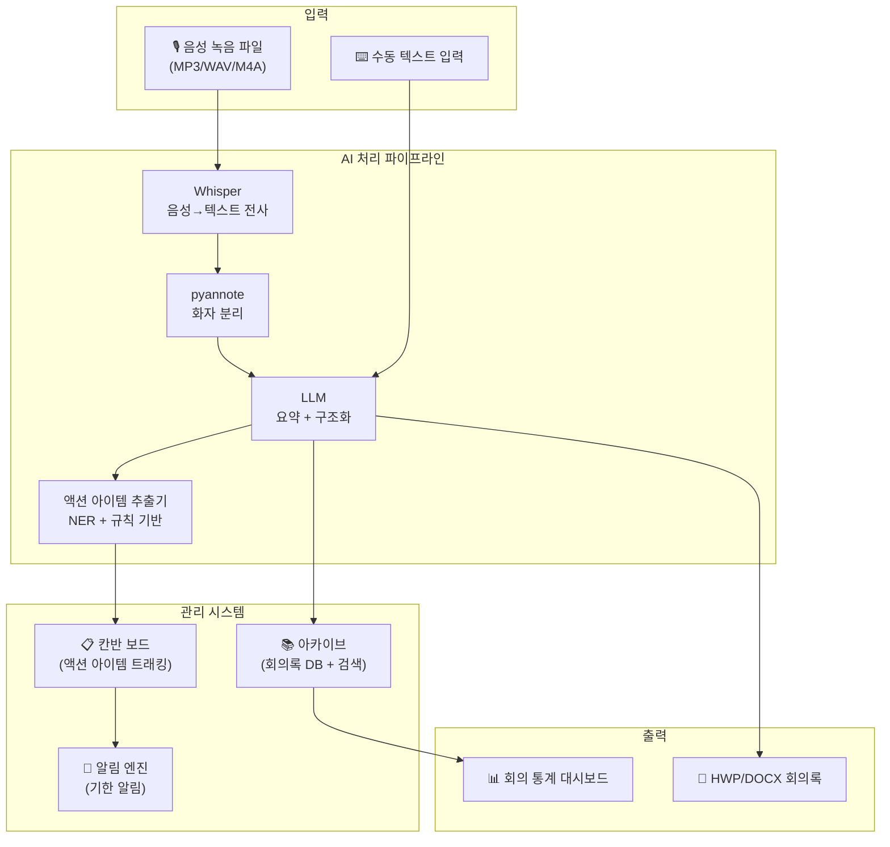
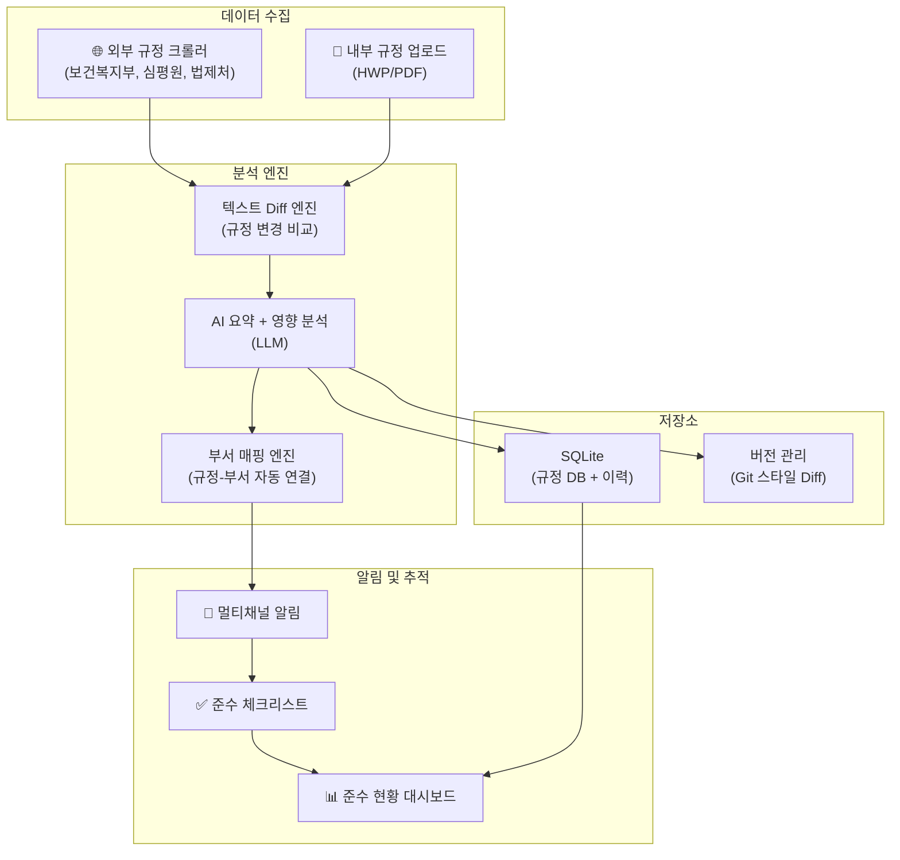
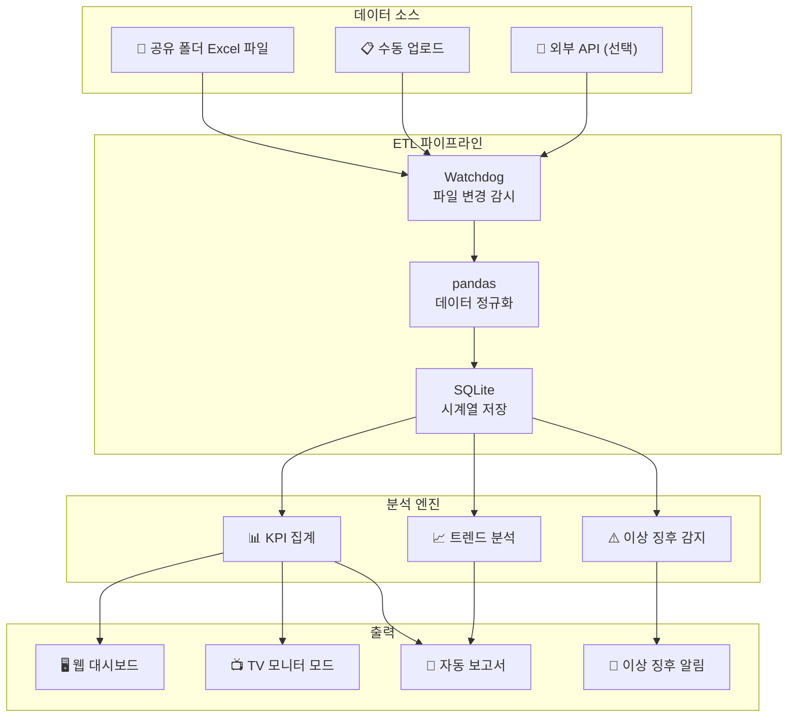
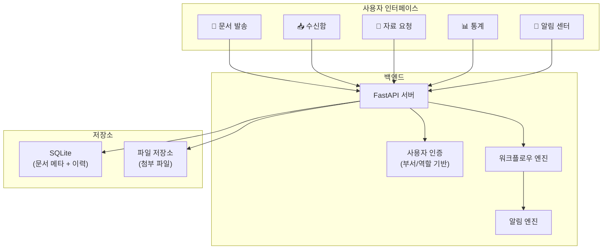
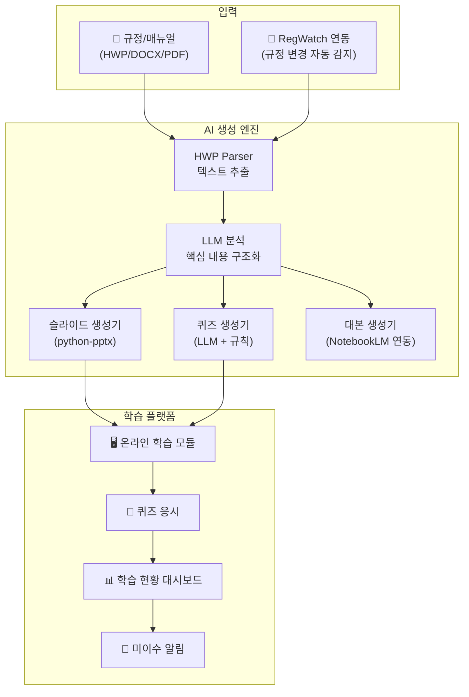
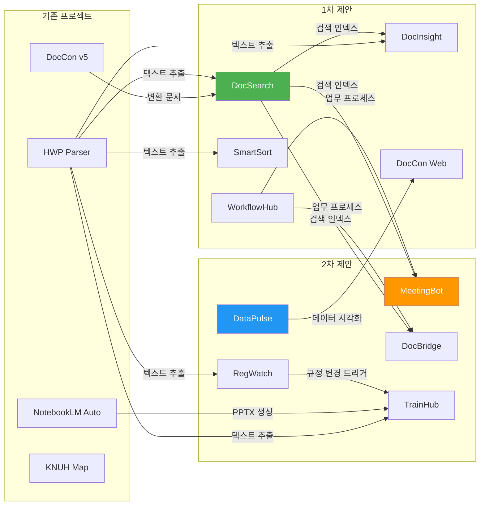

# 📋 AVGT 신규 업무 개선 프로젝트 제안 보고서 (V2)

> **작성일**: 2026-04-23  
> **작성자**: Antigravity AI  
> **대상**: 강원대학교병원 AVGT 업무 자동화 프로젝트  
> **문서 유형**: 프로젝트 기획 보고서 — 2차 제안 (6~10번)

---

## 목차

1. [프로젝트 F: MeetingBot (AI 회의록 자동화)](#프로젝트-f-meetingbot--ai-회의록-자동화)
2. [프로젝트 G: RegWatch (규정 변경 모니터링)](#프로젝트-g-regwatch--규정-변경-모니터링)
3. [프로젝트 H: DataPulse (운영 데이터 BI 대시보드)](#프로젝트-h-datapulse--운영-데이터-bi-대시보드)
4. [프로젝트 I: DocBridge (부서 간 문서 협업 포털)](#프로젝트-i-docbridge--부서-간-문서-협업-포털)
5. [프로젝트 J: TrainHub (직원 교육 자료 자동 생성)](#프로젝트-j-trainhub--직원-교육-자료-자동-생성)
6. [종합 비교 및 1차 제안과의 연계](#6-종합-비교-및-1차-제안과의-연계)

---

## 프로젝트 F: MeetingBot — AI 회의록 자동화

### F.1 개요

> **한 줄 요약**: 회의 녹음 파일을 업로드하면 AI가 자동으로 회의록을 작성하고, 액션 아이템을 추출하며, 후속 조치까지 추적하는 원스톱 회의 관리 시스템

병원은 매주 수십 건의 회의(운영회의, 의료질평가, 감염관리, 안전관리 등)가 진행됩니다. 회의록 작성은 담당자의 상당한 시간을 소모하며, 결정 사항의 후속 이행도 체계적으로 추적되지 않는 경우가 많습니다.

### F.2 해결하려는 문제

````carousel
**🔴 현재 상태 (회의록 작성)**

```
회의 종료 → 담당자가 수기 메모 정리 (30~60분)
         → HWP 양식에 옮겨 쓰기 (20분)
         → 결정사항 추출 (개인 기억에 의존)
         → 후속 조치 추적: ❌ 없음 (다음 회의에서 구두 확인)
```

**문제점**: 회의 1건당 약 1~1.5시간 소요, 결정사항 이행 추적 실패율 높음
<!-- slide -->
**🟢 목표 상태 (MeetingBot)**

```
회의 녹음 파일 업로드 (또는 실시간 음성 입력)
         → AI 자동 전사 (Whisper) + 화자 분리
         → AI 회의록 자동 작성 (요약 + 상세)
         → 액션 아이템 자동 추출 (담당자, 기한 포함)
         → 후속 조치 자동 트래킹 + 기한 알림
```

**절감**: 회의록 작성 **5분**, 후속 조치 이행률 **90%+**
````

### F.3 핵심 기능

| 기능 | 상세 설명 |
|------|----------|
| **음성→텍스트 전사** | OpenAI Whisper (large-v3)로 한국어 음성을 텍스트로 변환. 정확도 95%+ |
| **화자 분리 (Diarization)** | pyannote.audio 기반 화자 식별. "과장: ...", "원장: ..." 형태로 자동 태깅 |
| **AI 회의록 생성** | LLM이 전사 텍스트를 분석하여 ① 요약(3줄) ② 논의사항 ③ 결정사항 ④ 액션아이템 자동 분류 |
| **액션 아이템 추출** | 결정사항에서 "누가, 무엇을, 언제까지" 자동 추출. 담당자/기한/우선순위 태깅 |
| **후속 조치 트래킹** | 칸반 보드 형태로 진행 상황 관리 (할 일 → 진행중 → 완료). 기한 D-3, D-1 자동 알림 |
| **회의록 아카이브** | 모든 회의록을 DB에 저장, 키워드 검색, 날짜/부서/주제별 필터링 |
| **양식 출력** | 병원 표준 회의록 양식(HWP/DOCX/PDF)으로 1클릭 자동 포맷팅 |

### F.4 기술 아키텍처



### F.5 기술 스택

| 계층 | 기술 | 선정 이유 |
|------|------|----------|
| 음성 전사 | **OpenAI Whisper (large-v3)** | 한국어 정확도 최고, 로컬 실행 가능 |
| 화자 분리 | **pyannote.audio** | 오픈소스 최고 성능 화자 분리 |
| LLM | **Gemini API** | 긴 회의 전사문(10만 토큰+) 처리 가능 |
| 백엔드 | **Python + FastAPI** | 비동기 처리, 파일 업로드 |
| DB | **SQLite** | 회의록 + 액션 아이템 저장 |
| 프론트엔드 | **Vanilla HTML/CSS/JS** | 칸반 보드 + 회의록 뷰어 |
| 알림 | **Windows Toast + 이메일 (smtplib)** | 다중 채널 알림 |

### F.6 기존 자산 연계

- **NotebookLM Automation**: 오디오 처리 경험 (NotebookLM 오디오 오버뷰 파이프라인), `config.yaml` 설정 패턴
- **DocCon v5**: 회의록을 마크다운으로 변환 → 검색/분석 파이프라인에 연결
- **HWP Parser**: 기존 회의록 양식(HWP) 파싱 → 자동 템플릿 추출
- **1차 제안 연계**: DocSearch에 회의록 자동 인덱싱, WorkflowHub에 액션 아이템 연동

### F.7 예상 개발 일정

| 단계 | 작업 | 소요 기간 |
|------|------|----------|
| Phase 1 | Whisper 전사 + 화자 분리 파이프라인 | 3~4일 |
| Phase 2 | LLM 회의록 생성 + 액션 아이템 추출 | 3~4일 |
| Phase 3 | 칸반 보드 + 알림 시스템 | 3~4일 |
| Phase 4 | 양식 출력 + 아카이브 검색 + 폴리싱 | 2~3일 |
| **합계** | | **11~15일** |

### F.8 기대 효과

- ⏱️ **회의록 작성**: 60분 → 5분 (92% 단축)
- ✅ **결정사항 이행률**: 추적 없음 → 90%+ (자동 알림)
- 🔍 **과거 회의 검색**: 불가능 → 키워드 즉시 검색
- 📊 **회의 효율 분석**: 회의 빈도, 소요 시간, 미이행 건수 등 통계화

---

## 프로젝트 G: RegWatch — 규정 변경 모니터링

### G.1 개요

> **한 줄 요약**: 의료법, 병원 내규, 보건복지부 고시, 건강보험 기준 등의 변경 사항을 자동 수집·비교하고, 영향받는 부서/업무에 즉시 알림을 보내는 규정 모니터링 시스템

병원은 수백 개의 내부 규정과 외부 법규를 준수해야 합니다. 규정이 변경되면 해당 업무 담당자가 이를 인지하고 관련 내부 절차를 업데이트해야 하지만, 현재는 **각자 알아서 확인**하는 구조입니다.

### G.2 해결하려는 문제

- **외부 규정 추적 어려움**: 보건복지부, 건강보험심사평가원, 강원도청 등 다수 기관의 고시/지침 변경을 개인이 모두 추적 불가
- **내부 규정 버전 관리**: 규정 개정 시 이전 버전과의 차이를 파악하기 어려움
- **영향 분석 부재**: 규정 변경이 어떤 부서/업무에 영향을 미치는지 체계적으로 분석되지 않음
- **누락 위험**: 규정 변경 미인지로 인한 평가·감사 불이익 위험

### G.3 핵심 기능

| 기능 | 상세 설명 |
|------|----------|
| **외부 규정 자동 수집** | 보건복지부, 심평원, 강원도청 등의 공시/고시 RSS/웹 크롤링. 신규·변경 건 자동 감지 |
| **내부 규정 버전 관리** | 병원 내규(HWP/PDF)를 업로드하면 이전 버전과 Diff 비교, 변경 이력 Git 스타일 추적 |
| **AI 영향 분석** | 변경된 규정의 핵심 내용을 AI가 요약하고, 영향받는 부서/업무를 자동 매핑 |
| **자동 알림** | 관련 부서 담당자에게 규정 변경 알림 발송 (이메일/시스템 트레이/카카오워크 등) |
| **규정 검색 엔진** | 모든 내·외부 규정을 전문 검색. "수술 동의서 관련 규정"으로 즉시 검색 |
| **준수 체크리스트** | 규정 변경에 따른 후속 조치 체크리스트 자동 생성, 이행 현황 트래킹 |
| **대시보드** | 규정 변경 타임라인, 미조치 건수, 부서별 준수 현황 시각화 |

### G.4 기술 아키텍처



### G.5 기술 스택

| 계층 | 기술 | 선정 이유 |
|------|------|----------|
| 웹 크롤링 | **Scrapy + BeautifulSoup** | 정부 사이트 구조적 파싱 |
| Diff 엔진 | **difflib + custom** | Python 내장 Diff, 한글 문서 특화 |
| AI 분석 | **Gemini API** | 규정 텍스트 요약 + 영향 분석 |
| 백엔드 | **Python + FastAPI** | 비동기, 스케줄링 |
| 스케줄러 | **APScheduler** | 일별/주별 자동 크롤링 |
| 문서 파싱 | **HWP Parser (기존)** | 내부 규정 HWP 텍스트 추출 |
| DB | **SQLite** | 규정 + 버전 이력 |
| 프론트엔드 | **Vanilla HTML/CSS/JS** | 대시보드 + Diff 뷰어 |

### G.6 기존 자산 연계

- **HWP Parser**: 내부 규정 문서(HWP) 텍스트 추출에 `converter.py` 직접 사용
- **DocCon v5**: 규정 문서를 마크다운으로 일괄 변환하여 검색/비교 가능하게 처리
- **DocSearch (1차 제안)**: 규정 검색을 DocSearch 인덱스에 통합

### G.7 예상 개발 일정

| 단계 | 작업 | 소요 기간 |
|------|------|----------|
| Phase 1 | 내부 규정 업로드 + Diff 엔진 | 3~4일 |
| Phase 2 | 외부 규정 크롤러 + 자동 수집 | 3~4일 |
| Phase 3 | AI 영향 분석 + 부서 매핑 | 3~4일 |
| Phase 4 | 알림 + 체크리스트 + 대시보드 | 3~4일 |
| **합계** | | **12~16일** |

### G.8 기대 효과

- 🛡️ **규정 미인지 위험**: 높음 → 거의 제로 (자동 감지 + 알림)
- ⏱️ **규정 변경 확인**: 수동 검색 1시간+ → 자동 알림 0분
- 📋 **감사 대비**: 규정 준수 이력 자동 생성 → 감사 자료 즉시 제출
- 🔄 **규정 업데이트**: 변경사항 → 체크리스트 → 이행까지 자동 추적

---

## 프로젝트 H: DataPulse — 운영 데이터 BI 대시보드

### H.1 개요

> **한 줄 요약**: 병원 운영에서 발생하는 다양한 Excel/CSV 데이터를 자동 수집·집계하여 실시간 BI 대시보드로 시각화하고, 이상 징후를 자동 감지하는 운영 인텔리전스 플랫폼

병원 행정에서는 수많은 데이터가 Excel 파일 형태로 관리됩니다 (예: 수술중 초음파 사용 건수, 진료과별 실적, 장비 가동률 등). 이 데이터들은 각 부서별로 산재되어 있으며, 전체 현황을 한눈에 파악하기 어렵습니다.

### H.2 해결하려는 문제

````carousel
**📊 현재: 분산된 데이터 관리**

```
기획예산과: 예산_집행_현황.xlsx
의료정보팀: 진료_실적_202604.xlsx  
총무과:     인력_현황.xlsx
시설과:     장비_가동률.xlsx
           ↓
각자 따로 보고서 작성 (주 4~8시간 소요)
전체 현황 파악: 불가능
이상 징후 감지: 사후 감지
```
<!-- slide -->
**📈 목표: 통합 BI 대시보드**

```
자동 데이터 수집 (공유 폴더 감시)
         ↓
실시간 대시보드 (TV 모니터 또는 웹)
  ┌─────────────────────────────┐
  │ 📊 진료 실적  📈 수술 건수  │
  │ 💰 예산 집행  🏥 병상 가동  │
  │ ⚠️ 이상 징후 자동 알림      │
  └─────────────────────────────┘
보고서: 원클릭 자동 생성
```
````

### H.3 핵심 기능

| 기능 | 상세 설명 |
|------|----------|
| **데이터 커넥터** | Excel/CSV 파일 자동 감시 + 수집. 공유 폴더의 정기 보고 파일을 자동 인식·파싱 |
| **자동 ETL** | 데이터 정규화, 칼럼 매핑, 단위 통일, 결측값 처리 자동화 |
| **실시간 대시보드** | 핵심 KPI 카드 (진료 건수, 수술 건수, 병상 가동률, 예산 집행률 등), 시계열 차트, 파이 차트 |
| **드릴다운** | 전체 → 부서별 → 월별 → 일별로 클릭 탐색. 데이터 상세 뷰 |
| **이상 징후 감지** | Z-score 기반 이상치 탐지. 전월 대비 ±20% 이상 변동 시 자동 알림 |
| **자동 보고서** | 주간/월간 요약 보고서 PDF/PPTX 자동 생성. 비교 차트 + AI 코멘트 포함 |
| **TV 모니터 모드** | 전체화면 자동 순환 모드 (병원 로비 또는 회의실 TV 모니터용) |

### H.4 기술 아키텍처



### H.5 기술 스택

| 계층 | 기술 | 선정 이유 |
|------|------|----------|
| 데이터 처리 | **pandas + openpyxl** | Excel 파싱, DocCon에서 이미 검증 |
| 시계열 DB | **SQLite** | 경량, 충분한 성능 |
| 시각화 | **Chart.js + ApexCharts** | 실시간 업데이트, 반응형 |
| 백엔드 | **Python + FastAPI** | WebSocket으로 실시간 대시보드 |
| 이상 감지 | **scipy (Z-score) + pandas** | 통계적 이상치 탐지 |
| 보고서 생성 | **python-pptx + WeasyPrint** | PPTX/PDF 자동 생성 |
| 프론트엔드 | **Vanilla HTML/CSS/JS** | 경량 SPA, TV 모니터 모드 |

### H.6 기존 자산 연계

- **DocCon v5**: Excel 엔진(`python_excel`)의 openpyxl 활용 패턴 재사용
- **NotebookLM Automation**: PPTX 생성 경험 (`create_pptx.py`, `merge_pptx.py`) → 보고서 PPTX 자동 생성
- **KNUH Scenario Map**: Streamlit/웹 배포 경험, 시각화 패턴
- **실제 데이터**: 워크스페이스의 `~$첨부1_2025년 수술중 초음파 사용 건수.xlsx`가 첫 데이터 소스 후보

### H.7 예상 개발 일정

| 단계 | 작업 | 소요 기간 |
|------|------|----------|
| Phase 1 | 데이터 커넥터 + ETL (Excel 자동 파싱) | 3~4일 |
| Phase 2 | 대시보드 UI + KPI 카드 + 차트 | 4~5일 |
| Phase 3 | 이상 징후 감지 + 알림 | 2~3일 |
| Phase 4 | 자동 보고서 + TV 모드 + 폴리싱 | 3~4일 |
| **합계** | | **12~16일** |

### H.8 기대 효과

- ⏱️ **보고서 작성**: 주 4~8시간 → 자동 생성 (95% 절감)
- 📊 **현황 파악**: 부서별 문의 → 대시보드 1초 확인
- ⚠️ **이상 징후**: 사후 감지 → 실시간 자동 알림
- 📺 **의사결정 지원**: 회의실 TV에 실시간 데이터 표시 → 데이터 기반 의사결정

---

## 프로젝트 I: DocBridge — 부서 간 문서 협업 포털

### I.1 개요

> **한 줄 요약**: 부서 간 문서 공유·요청·승인을 웹 기반으로 처리하고, 문서 수·발신 이력을 자동 추적하는 내부 문서 협업 플랫폼

병원 행정에서 부서 간 공문 발송, 자료 요청, 첨부 파일 전달은 이메일이나 물리적 문서에 의존하는 경우가 많습니다. 이는 이력 추적이 어렵고, 문서가 누락되거나 중복 요청이 발생할 수 있습니다.

### I.2 해결하려는 문제

- **문서 전달 이력 부재**: "이 공문을 보냈나?", "받았나?" 확인 불가
- **자료 요청 추적 어려움**: "지난주 요청한 자료는?" → 이메일 뒤적거리기
- **중복 요청**: 같은 자료를 여러 부서에서 각각 요청
- **긴급 문서 우선순위**: 긴급 공문이 일반 메일에 묻힘

### I.3 핵심 기능

| 기능 | 상세 설명 |
|------|----------|
| **문서 발송 관리** | 공문/자료를 시스템에 등록하면 수신 부서에 자동 알림. 수신 확인 자동 트래킹 |
| **자료 요청 시스템** | "이런 자료가 필요합니다" → 담당 부서에 요청 → 진행 상황 실시간 확인 |
| **문서 수·발신 이력** | 모든 문서의 발신/수신/열람 이력을 자동 기록. 완전한 감사 추적(Audit Trail) |
| **우선순위 관리** | 긴급/일반/참고 등급 분류. 긴급 문서는 팝업 알림 |
| **공유 문서함** | 부서별/주제별 공유 문서함. 자주 사용하는 양식·매뉴얼 중앙 관리 |
| **알림 센터** | 신규 문서, 요청 접수, 기한 임박 등 통합 알림. 읽지 않은 항목 배지 표시 |
| **통계 대시보드** | 부서별 문서 발송/수신 건수, 평균 처리 시간, 미처리 건 현황 |

### I.4 기술 아키텍처



### I.5 기술 스택

| 계층 | 기술 | 선정 이유 |
|------|------|----------|
| 백엔드 | **Python + FastAPI** | REST API + 파일 업로드 |
| 인증 | **JWT + 역할 기반** | 부서별 접근 제어 |
| DB | **SQLite** | 문서 메타데이터 + 이력 |
| 파일 저장 | **로컬 파일시스템 (NAS 연동)** | 기존 인프라 활용 |
| 알림 | **WebSocket + Email + Toast** | 실시간 + 비동기 멀티채널 |
| 프론트엔드 | **Vanilla HTML/CSS/JS** | 반응형, 이메일 클라이언트 스타일 UI |

### I.6 기존 자산 연계

- **DocCon v5**: 발송 문서를 자동 변환하여 검색 가능하게 저장
- **HWP Parser**: 공문 HWP 파일의 수신자/제목/발신자 메타데이터 자동 추출
- **WorkflowHub (1차 제안)**: 문서 발송 → 승인 프로세스 연동
- **DocSearch (1차 제안)**: 발송/수신된 문서를 검색 인덱스에 자동 등록

### I.7 예상 개발 일정

| 단계 | 작업 | 소요 기간 |
|------|------|----------|
| Phase 1 | 사용자 인증 + 문서 발송/수신 | 4~5일 |
| Phase 2 | 자료 요청 + 워크플로우 | 3~4일 |
| Phase 3 | 알림 시스템 + 통계 대시보드 | 3~4일 |
| Phase 4 | 공유 문서함 + 폴리싱 | 2~3일 |
| **합계** | | **12~16일** |

### I.8 기대 효과

- 📧 **문서 전달 확인**: 불확실 → 100% 추적 (수신 확인 자동)
- ⏱️ **자료 요청 처리**: 평균 3일 → 1일 (진행 상황 가시화 + 알림)
- 🔍 **이력 조회**: 이메일 검색 → DB 즉시 조회
- 📊 **업무 분석**: 부서 간 문서 흐름 시각화 → 병목 식별

---

## 프로젝트 J: TrainHub — 직원 교육 자료 자동 생성

### J.1 개요

> **한 줄 요약**: 병원 내부 규정·매뉴얼·업무 지침서를 AI가 분석하여 자동으로 교육 자료(슬라이드, 퀴즈, 동영상 스크립트)를 생성하고, 직원 학습 현황을 관리하는 교육 플랫폼

병원은 신규 직원 교육, 정기 보수 교육, 규정 변경에 따른 긴급 교육 등 다양한 교육 수요가 있습니다. 매번 교육 자료를 수작업으로 만드는 것은 상당한 시간과 노력이 필요합니다.

### J.2 해결하려는 문제

````carousel
**📚 교육 자료 제작 현실**

```
규정/매뉴얼 변경
  → 교육 담당자가 내용 파악 (2~4시간)
  → PPT 자료 제작 (4~8시간)  
  → 퀴즈/평가 문제 출제 (1~2시간)
  → 교육 실시 + 결과 취합 (수기)
  
건당 10~16시간 소요, 연간 수십 건
```
<!-- slide -->
**🤖 TrainHub 자동화 후**

```
규정/매뉴얼 업로드 (또는 RegWatch 연동)
  → AI가 핵심 내용 분석 (자동)
  → 교육 슬라이드 자동 생성 (3분)
  → 퀴즈 자동 출제 (1분)
  → 온라인 학습 + 자동 결과 집계
  
건당 30분 이내 (97% 절감)
```
````

### J.3 핵심 기능

| 기능 | 상세 설명 |
|------|----------|
| **원본 자료 분석** | 규정/매뉴얼/지침서(HWP/DOCX/PDF)를 업로드하면 AI가 핵심 내용을 구조화 |
| **슬라이드 자동 생성** | 분석된 내용을 기반으로 교육용 PPTX 자동 생성 (NotebookLM 파이프라인 활용) |
| **퀴즈 자동 출제** | 핵심 내용에서 O/X, 객관식, 단답형 문제 자동 생성 (LLM) |
| **온라인 학습 모듈** | 웹 기반 자기주도 학습. 슬라이드 뷰어 + 퀴즈 응시 + 결과 제출 |
| **학습 현황 관리** | 직원별 이수 현황, 점수, 미이수 알림. 부서별 교육 이수율 대시보드 |
| **교육 이력 아카이브** | 모든 교육 자료와 이수 기록을 DB에 보관. 감사/인증 심사 자료 즉시 제출 |
| **동영상 스크립트** | AI가 교육 내용을 기반으로 강의 대본 자동 작성 (NotebookLM 오디오 오버뷰 연동) |

### J.4 기술 아키텍처



### J.5 기술 스택

| 계층 | 기술 | 선정 이유 |
|------|------|----------|
| 문서 파싱 | **HWP Parser + python-docx + PyMuPDF** | 기존 자산 100% 재사용 |
| AI 생성 | **Gemini API** | 한국어 교육 자료 생성 품질 우수 |
| 슬라이드 | **python-pptx** | NotebookLM Automation에서 검증 |
| 백엔드 | **Python + FastAPI** | REST API + 학습 관리 |
| DB | **SQLite** | 교육 이력 + 학습 기록 |
| 프론트엔드 | **Vanilla HTML/CSS/JS** | 슬라이드 뷰어 + 퀴즈 UI |

### J.6 기존 자산 연계

- **NotebookLM Automation**: PPTX 생성 엔진 (`create_pptx.py`) 직접 재사용. 오디오 오버뷰로 교육 동영상 생성
- **HWP Parser**: 교육 원본 자료(HWP) 텍스트 추출에 `converter.py` 사용
- **DocCon v5**: 교육 자료를 마크다운으로 변환 → NotebookLM 소스로 업로드
- **RegWatch (2차 제안)**: 규정 변경 감지 → 교육 자료 자동 생성 트리거
- **MeetingBot (2차 제안)**: 교육 결과 회의에서의 결정사항 자동 추적

### J.7 예상 개발 일정

| 단계 | 작업 | 소요 기간 |
|------|------|----------|
| Phase 1 | 원본 분석 + AI 슬라이드/퀴즈 생성 | 4~5일 |
| Phase 2 | 온라인 학습 모듈 (슬라이드 뷰어 + 퀴즈) | 4~5일 |
| Phase 3 | 학습 현황 관리 + 알림 | 3~4일 |
| Phase 4 | 동영상 스크립트 + 아카이브 + 폴리싱 | 2~3일 |
| **합계** | | **13~17일** |

### J.8 기대 효과

- ⏱️ **교육 자료 제작**: 10~16시간 → 30분 (97% 절감)
- 📊 **교육 이수율 관리**: 수기 집계 → 자동 대시보드
- 🎯 **교육 품질**: AI 기반 핵심 내용 추출 → 중요사항 누락 방지
- 📋 **인증 심사 대비**: 교육 이력 자동 보관 → 즉시 자료 제출

---

## 6. 종합 비교 및 1차 제안과의 연계

### 6.1 2차 제안 비교 매트릭스

| 평가 항목 | MeetingBot | RegWatch | DataPulse | DocBridge | TrainHub |
|-----------|:----------:|:--------:|:---------:|:---------:|:--------:|
| **즉시 실용성** | ⭐⭐⭐⭐⭐ | ⭐⭐⭐⭐ | ⭐⭐⭐⭐⭐ | ⭐⭐⭐ | ⭐⭐⭐ |
| **기술 난이도** | ⭐⭐⭐⭐ | ⭐⭐⭐ | ⭐⭐⭐ | ⭐⭐⭐ | ⭐⭐⭐⭐ |
| **기존 자산 활용** | ⭐⭐⭐⭐ | ⭐⭐⭐⭐ | ⭐⭐⭐⭐⭐ | ⭐⭐⭐ | ⭐⭐⭐⭐⭐ |
| **업무 임팩트** | ⭐⭐⭐⭐⭐ | ⭐⭐⭐⭐⭐ | ⭐⭐⭐⭐⭐ | ⭐⭐⭐⭐ | ⭐⭐⭐⭐ |
| **개발 기간** | 11~15일 | 12~16일 | 12~16일 | 12~16일 | 13~17일 |
| **외부 의존성** | Whisper + LLM | LLM + 크롤링 | 없음 | 없음 | LLM |
| **추천 순위 (2차 내)** | **🥇 1위** | 🥈 2위 | **🥉 3위** | 4위 | 5위 |

### 6.2 전체 10개 프로젝트 통합 순위

| 순위 | 프로젝트 | 핵심 가치 | 개발 기간 | 차수 |
|:----:|---------|----------|:---------:|:----:|
| 🥇 1 | **DocSearch** | 내부 문서 즉시 검색 | 5~8일 | 1차 |
| 🥈 2 | **WorkflowHub** | 병원 업무 자동화 | 11~15일 | 1차 |
| 🥉 3 | **DocInsight** | AI 문서 분석 | 12~16일 | 1차 |
| 4 | DocCon Web | 변환 모니터링 | 8~12일 | 1차 |
| 5 | SmartSort | AI 파일 분류 | 10~14일 | 1차 |
| **6** | **MeetingBot** | 회의록 자동화 | 11~15일 | **2차** |
| **7** | **RegWatch** | 규정 변경 모니터링 | 12~16일 | **2차** |
| **8** | **DataPulse** | 운영 데이터 BI | 12~16일 | **2차** |
| **9** | **DocBridge** | 문서 협업 포털 | 12~16일 | **2차** |
| **10** | **TrainHub** | 교육 자료 자동화 | 13~17일 | **2차** |

### 6.3 전체 시너지 맵 (1차 + 2차)



> [!TIP]
> **2차 제안의 핵심 추천: MeetingBot (F)**  
> 병원의 회의 빈도가 높고, 회의록 작성 부담이 크다면 MeetingBot이 가장 즉각적인 임팩트를 줄 수 있습니다. Whisper 기반 한국어 음성 전사는 이미 높은 정확도를 달성했으며, 기존 NotebookLM 오디오 경험을 직접 활용할 수 있습니다.

> [!IMPORTANT]
> 1차와 2차의 10개 프로젝트 모두 **동일한 기술 기반**(Python + FastAPI + SQLite + Vanilla JS)으로 설계되어 있어, 하나의 프로젝트에서 쌓은 경험이 다른 프로젝트에 직접 이전됩니다. 어떤 프로젝트부터 시작하시겠습니까?
